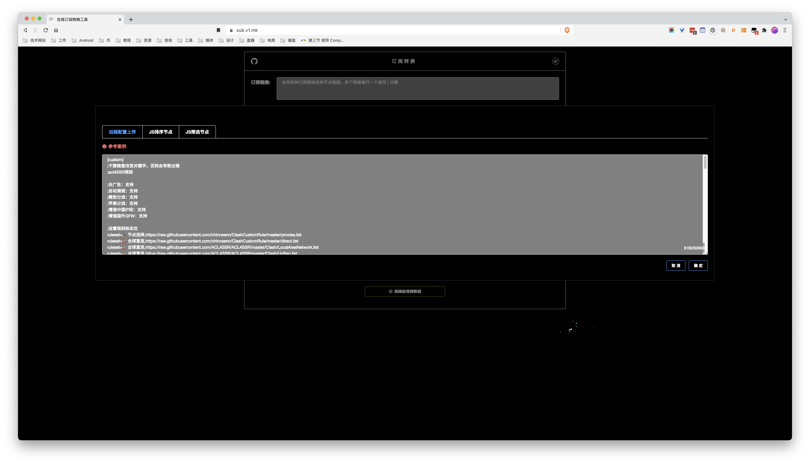
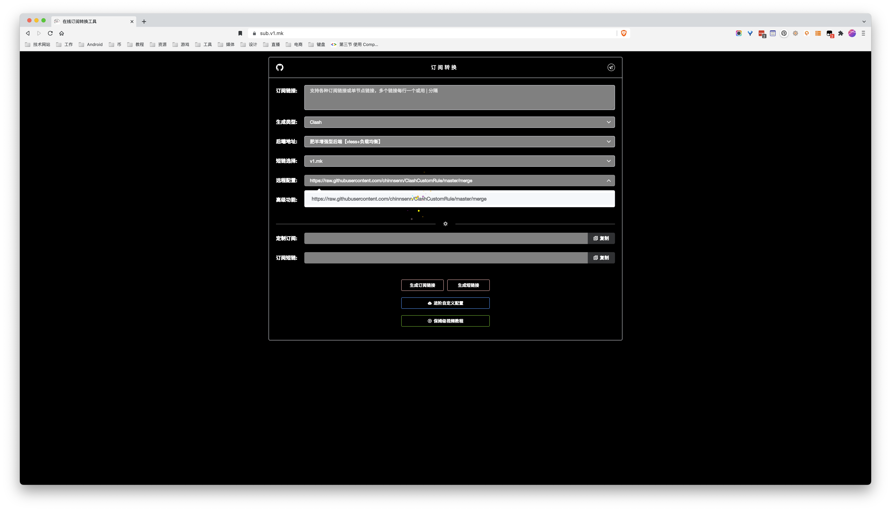

# 打造一个属于自己的clash分流配置

- 仅保证支持 clash 内核软件 (clashx, openclash, clash for windows 等等...)
- 需要使用订阅转换服务，(我用的 https://sub.v1.mk/ ，理论上有「远程配置」或「自定义配置功能」的订阅转换服务都可以，有能力也可以自建 https://github.com/tindy2013/subconverter )，这里都订阅转换服务的安全性不做保证，自行判断。

## 太长不看
> 如果不想了解什么规则，只想快点用上，可以按照这个步骤生成转换的订阅连接:

[推荐方案二!!](#方案二（推荐）)

### 方案一：

1. 直接复制[配置总规则](#配置总规则)从`[custom]`开始到方框末尾也就是`luck`的位置
2. 打开 https://sub.v1.mk/ 
3. 在第一个框填入你机场的订阅连接
4. 点击底部`[上传自定义配置]`，将第一步复制的内容粘贴进去
5. 其他不用动，点击生成订阅链接
6. 随后将生成的订阅链接添加到 clash 软件的订阅配置
7. 更新完订阅后，你可以在 clash 面板自由的选择 DisneyPlus 和 Netflix 需要走哪个节点。

步骤 4 如下图位置


由于一般订阅转换服务如果配置自定义的分流规则，一般只保存三个月，所以有方案二。
### 方案二（推荐）
1. 在 Github 新建一个属于自己的仓库(如: MyClashRule)(具体注册账号，新建仓库就不赘述了)
2. 在 MyClashRule 下新建一个文件（如本仓库的[merge](merge)），不熟悉 Github 的在仓库首页找到 「Add file」 按钮，在编辑框粘贴进「方案一」步骤 1 的内容，点击下方 commit changs 按钮
3. 完成步骤 2 后会跳转到建好的文件界面，右上角找到「Raw」点击跳转到文件下载链接，浏览器地址栏复制该链接
4. 在订阅转换网站找到「远程配置」，粘贴步骤 3 复制的链接，然后在下拉框选择该链接的选项。

后续步骤如方案一

步骤 4 如下图位置


## 策略组分组效果


可以看到有`奈飞视频`和`迪士尼加`两个分组，由于 Disney+ 目前上线区域不多，所以适用于 Netflix 节点不一定可以用在 Disney +，所以可以分别在两个分组里选择`奈飞节点`和`迪士尼加节点`，然后前往`奈飞节点`和`迪士尼加节点`分组选择节点，逐个尝试。

以下配置是我从 [ACL_自动测速](https://raw.githubusercontent.com/ACL4SSR/ACL4SSR/master/Clash/config/ACL4SSR_Online_Full_AdblockPlus.ini)拷贝而来，并且根据自己需求添加 DisneyPlus 的分流策略，以及修改 Netflix 的节点选择方式

> 想要根据自己需求配置策略组或节点分组可以继续往下拉

### 配置总规则
```
[custom]
;不要随意改变关键字，否则会导致出错
;acl4SSR规则

;去广告：支持
;自动测速：支持
;微软分流：支持
;苹果分流：支持
;增强中国IP段：支持
;增强国外GFW：支持
;设置规则标志位
ruleset=🎯 全球直连,https://raw.githubusercontent.com/ACL4SSR/ACL4SSR/master/Clash/LocalAreaNetwork.list
ruleset=🎯 全球直连,https://raw.githubusercontent.com/ACL4SSR/ACL4SSR/master/Clash/UnBan.list
ruleset=🛑 广告拦截,https://raw.githubusercontent.com/ACL4SSR/ACL4SSR/master/Clash/BanAD.list
ruleset=🍃 应用净化,https://raw.githubusercontent.com/ACL4SSR/ACL4SSR/master/Clash/BanProgramAD.list
ruleset=🆎 AdBlock,https://raw.githubusercontent.com/ACL4SSR/ACL4SSR/master/Clash/BanEasyList.list
ruleset=🆎 AdBlock,https://raw.githubusercontent.com/ACL4SSR/ACL4SSR/master/Clash/BanEasyListChina.list
ruleset=🛡️ 隐私防护,https://raw.githubusercontent.com/ACL4SSR/ACL4SSR/master/Clash/BanEasyPrivacy.list
ruleset=📢 谷歌FCM,https://raw.githubusercontent.com/ACL4SSR/ACL4SSR/master/Clash/Ruleset/GoogleFCM.list
ruleset=🎯 全球直连,https://raw.githubusercontent.com/ACL4SSR/ACL4SSR/master/Clash/GoogleCN.list
ruleset=Ⓜ️ 微软云盘,https://raw.githubusercontent.com/ACL4SSR/ACL4SSR/master/Clash/OneDrive.list
ruleset=Ⓜ️ 微软服务,https://raw.githubusercontent.com/ACL4SSR/ACL4SSR/master/Clash/Microsoft.list
ruleset=🍎 苹果服务,https://raw.githubusercontent.com/ACL4SSR/ACL4SSR/master/Clash/Apple.list
ruleset=📲 电报消息,https://raw.githubusercontent.com/ACL4SSR/ACL4SSR/master/Clash/Telegram.list
ruleset=🎶 网易音乐,https://raw.githubusercontent.com/ACL4SSR/ACL4SSR/master/Clash/Ruleset/NetEaseMusic.list
ruleset=🎮 游戏平台,https://raw.githubusercontent.com/ACL4SSR/ACL4SSR/master/Clash/Ruleset/Epic.list
ruleset=🎮 游戏平台,https://raw.githubusercontent.com/ACL4SSR/ACL4SSR/master/Clash/Ruleset/Sony.list
ruleset=🎮 游戏平台,https://raw.githubusercontent.com/ACL4SSR/ACL4SSR/master/Clash/Ruleset/Steam.list
ruleset=📹 油管视频,https://raw.githubusercontent.com/ACL4SSR/ACL4SSR/master/Clash/Ruleset/YouTube.list
ruleset=🎥 奈飞视频,https://raw.githubusercontent.com/ACL4SSR/ACL4SSR/master/Clash/Ruleset/Netflix.list
ruleset=🎥 迪士尼加,https://raw.githubusercontent.com/ACL4SSR/ACL4SSR/master/Clash/Ruleset/DisneyPlus.list
ruleset=📺 巴哈姆特,https://raw.githubusercontent.com/ACL4SSR/ACL4SSR/master/Clash/Ruleset/Bahamut.list
ruleset=📺 哔哩哔哩,https://raw.githubusercontent.com/ACL4SSR/ACL4SSR/master/Clash/Ruleset/Bilibili.list
ruleset=📺 哔哩哔哩,https://raw.githubusercontent.com/ACL4SSR/ACL4SSR/master/Clash/Ruleset/BilibiliHMT.list
ruleset=🌏 国内媒体,https://raw.githubusercontent.com/ACL4SSR/ACL4SSR/master/Clash/ChinaMedia.list
ruleset=🌍 国外媒体,https://raw.githubusercontent.com/ACL4SSR/ACL4SSR/master/Clash/ProxyMedia.list
ruleset=🚀 节点选择,https://raw.githubusercontent.com/ACL4SSR/ACL4SSR/master/Clash/ProxyGFWlist.list
ruleset=🎯 全球直连,https://raw.githubusercontent.com/ACL4SSR/ACL4SSR/master/Clash/ChinaDomain.list
ruleset=🎯 全球直连,https://raw.githubusercontent.com/ACL4SSR/ACL4SSR/master/Clash/ChinaCompanyIp.list
ruleset=🎯 全球直连,https://raw.githubusercontent.com/ACL4SSR/ACL4SSR/master/Clash/Download.list
ruleset=🎯 全球直连,[]GEOIP,CN
ruleset=🐟 漏网之鱼,[]FINAL
;设置规则标志位

;设置分组标志位
custom_proxy_group=🚀 节点选择`select`[]♻️ 自动选择`[]🔯 故障转移`[]🔮 负载均衡`[]🇭🇰 香港节点`[]🇨🇳 台湾节点`[]🇸🇬 狮城节点`[]🇯🇵 日本节点`[]🇺🇲 美国节点`[]🇰🇷 韩国节点`[]🚀 手动切换`[]DIRECT
custom_proxy_group=🚀 手动切换`select`(^(?!.*(IPV6|用户|本站|漏洞|永久虚通路)).*)
custom_proxy_group=♻️ 自动选择`url-test`(^(?!.*(IPV6|用户|本站|漏洞|永久虚通路)).*)`http://www.gstatic.com/generate_204`7200,5,50
custom_proxy_group=🔯 故障转移`fallback`(^(?!.*(IPV6|用户|本站|漏洞|永久虚通路)).*)`http://www.gstatic.com/generate_204`7200,5,50
custom_proxy_group=🔮 负载均衡`load-balance`(^(?!.*(IPV6|用户|本站|漏洞|永久虚通路)).*)`http://www.gstatic.com/generate_204`7200,5,50
custom_proxy_group=📲 电报消息`select`[]🚀 节点选择`[]♻️ 自动选择`[]🇸🇬 狮城节点`[]🇭🇰 香港节点`[]🇨🇳 台湾节点`[]🇯🇵 日本节点`[]🇺🇲 美国节点`[]🇰🇷 韩国节点`[]🚀 手动切换`[]DIRECT
custom_proxy_group=📹 油管视频`select`[]🚀 节点选择`[]♻️ 自动选择`[]🇸🇬 狮城节点`[]🇭🇰 香港节点`[]🇨🇳 台湾节点`[]🇯🇵 日本节点`[]🇺🇲 美国节点`[]🇰🇷 韩国节点`[]🚀 手动切换`[]DIRECT
custom_proxy_group=🎥 奈飞视频`select`[]🎥 奈飞节点`[]🚀 节点选择`[]♻️ 自动选择`[]🇸🇬 狮城节点`[]🇭🇰 香港节点`[]🇨🇳 台湾节点`[]🇯🇵 日本节点`[]🇺🇲 美国节点`[]🇰🇷 韩国节点`[]🚀 手动切换`[]DIRECT
custom_proxy_group=🎥 迪士尼加`select`[]🎥 迪士尼加节点`[]🚀 节点选择`[]♻️ 自动选择`[]🇸🇬 狮城节点`[]🇭🇰 香港节点`[]🇨🇳 台湾节点`[]🇯🇵 日本节点`[]🇺🇲 美国节点`[]🇰🇷 韩国节点`[]🚀 手动切换`[]DIRECT
custom_proxy_group=📺 巴哈姆特`select`[]🇨🇳 台湾节点`[]🚀 节点选择`[]🚀 手动切换`[]DIRECT
custom_proxy_group=📺 哔哩哔哩`select`[]🎯 全球直连`[]🇨🇳 台湾节点`[]🇭🇰 香港节点
custom_proxy_group=🌍 国外媒体`select`[]🚀 节点选择`[]♻️ 自动选择`[]🇭🇰 香港节点`[]🇨🇳 台湾节点`[]🇸🇬 狮城节点`[]🇯🇵 日本节点`[]🇺🇲 美国节点`[]🇰🇷 韩国节点`[]🚀 手动切换`[]DIRECT
custom_proxy_group=🌏 国内媒体`select`[]DIRECT`[]🇭🇰 香港节点`[]🇨🇳 台湾节点`[]🇸🇬 狮城节点`[]🇯🇵 日本节点`[]🚀 手动切换
custom_proxy_group=📢 谷歌FCM`select`[]DIRECT`[]🚀 节点选择`[]🇺🇲 美国节点`[]🇭🇰 香港节点`[]🇨🇳 台湾节点`[]🇸🇬 狮城节点`[]🇯🇵 日本节点`[]🇰🇷 韩国节点`[]🚀 手动切换
custom_proxy_group=Ⓜ️ 微软云盘`select`[]DIRECT`[]🚀 节点选择`[]🇺🇲 美国节点`[]🇭🇰 香港节点`[]🇨🇳 台湾节点`[]🇸🇬 狮城节点`[]🇯🇵 日本节点`[]🇰🇷 韩国节点`[]🚀 手动切换
custom_proxy_group=Ⓜ️ 微软服务`select`[]DIRECT`[]🚀 节点选择`[]🇺🇲 美国节点`[]🇭🇰 香港节点`[]🇨🇳 台湾节点`[]🇸🇬 狮城节点`[]🇯🇵 日本节点`[]🇰🇷 韩国节点`[]🚀 手动切换
custom_proxy_group=🍎 苹果服务`select`[]DIRECT`[]🚀 节点选择`[]🇺🇲 美国节点`[]🇭🇰 香港节点`[]🇨🇳 台湾节点`[]🇸🇬 狮城节点`[]🇯🇵 日本节点`[]🇰🇷 韩国节点`[]🚀 手动切换
custom_proxy_group=🎮 游戏平台`select`[]DIRECT`[]🚀 节点选择`[]🇺🇲 美国节点`[]🇭🇰 香港节点`[]🇨🇳 台湾节点`[]🇸🇬 狮城节点`[]🇯🇵 日本节点`[]🇰🇷 韩国节点`[]🚀 手动切换
custom_proxy_group=🎶 网易音乐`select`[]DIRECT`[]🚀 节点选择`[]♻️ 自动选择`(网易|音乐|解锁|Music|NetEase)
custom_proxy_group=🎯 全球直连`select`[]DIRECT`[]🚀 节点选择`[]♻️ 自动选择
custom_proxy_group=🛑 广告拦截`select`[]REJECT`[]DIRECT
custom_proxy_group=🍃 应用净化`select`[]REJECT`[]DIRECT
custom_proxy_group=🆎 AdBlock`select`[]REJECT`[]DIRECT
custom_proxy_group=🛡️ 隐私防护`select`[]REJECT`[]DIRECT
custom_proxy_group=🐟 漏网之鱼`select`[]🚀 节点选择`[]♻️ 自动选择`[]DIRECT`[]🇭🇰 香港节点`[]🇨🇳 台湾节点`[]🇸🇬 狮城节点`[]🇯🇵 日本节点`[]🇺🇲 美国节点`[]🇰🇷 韩国节点`[]🚀 手动切换
custom_proxy_group=🇭🇰 香港节点`url-test`(港|HK|Hong Kong)`http://www.gstatic.com/generate_204`7200,5,50
custom_proxy_group=🇯🇵 日本节点`url-test`(日本|川日|东京|大阪|泉日|埼玉|沪日|深日|[^-]日|JP|Japan)`http://www.gstatic.com/generate_204`7200,5,50
custom_proxy_group=🇺🇲 美国节点`url-test`(美|波特兰|达拉斯|俄勒冈|凤凰城|费利蒙|硅谷|拉斯维加斯|洛杉矶|圣何塞|圣克拉拉|西雅图|芝加哥|US|United States)`http://www.gstatic.com/generate_204`300,,150
custom_proxy_group=🇨🇳 台湾节点`url-test`(台|新北|彰化|TW|Taiwan)`http://www.gstatic.com/generate_204`7200,5,50
custom_proxy_group=🇸🇬 狮城节点`url-test`(新加坡|坡|狮城|SG|Singapore)`http://www.gstatic.com/generate_204`7200,5,50
custom_proxy_group=🇰🇷 韩国节点`url-test`(KR|Korea|KOR|首尔|韩|韓)`http://www.gstatic.com/generate_204`7200,5,50
custom_proxy_group=🎥 奈飞节点`select`(^(?!.*(IPV6|用户|本站|漏洞|永久虚通路)).*)
custom_proxy_group=🎥 迪士尼加节点`select`(^(?!.*(IPV6|用户|本站|漏洞|永久虚通路)).*)
;设置分组标志位

;custom_proxy_group=🚀 手动切换`select`(^(?!.*(IPV6|用户|本站|漏洞|永久虚通路)).*) 根据自己机场节点来过滤不用的节点，填入要排除的关键字，即可过滤包含关键字的节点

enable_rule_generator=true
overwrite_original_rules=true

;clash_rule_base=https://raw.githubusercontent.com/ACL4SSR/ACL4SSR/master/Clash/GeneralClashConfig.yml

;luck
```

## 进阶配置

以下规则说明均摘自 [订阅转换规则](https://github.com/tindy2013/subconverter/blob/master/README-cn.md#%E9%85%8D%E7%BD%AE%E6%96%87%E4%BB%B6)

### ruleset

> 从本地或 url 获取规则片段
>
> 格式为 `Group name,[type:]URL[,interval]` 或 `Group name,[]Rule `
>
> 支持的type（类型）包括：surge, quanx, clash-domain, clash-ipcidr, clash-classic
>
> type留空时默认为surge类型的规则
>
> \[] 前缀后的文字将被当作规则，而不是链接或路径，主要包含 `[]GEOIP` 和 `[]MATCH`(等同于 `[]FINAL`)。

    -   例如：

    ```ini
    ruleset=🍎 苹果服务,https://raw.githubusercontent.com/ACL4SSR/ACL4SSR/master/Clash/Apple.list
    # 表示引用 https://raw.githubusercontent.com/ACL4SSR/ACL4SSR/master/Clash/Apple.list 规则
    # 且将此规则指向 [proxy_group] 所设置 🍎 苹果服务 策略组
    ruleset=Domestic Services,clash-domain:https://ruleset.dev/clash_domestic_services_domains,86400
    # 表示引用clash-domain类型的 https://ruleset.dev/clash_domestic_services_domains 规则
    # 规则更新间隔为86400秒
    # 且将此规则指向 [proxy_group] 所设置 Domestic Services 策略组
    ruleset=🎯 全球直连,rules/NobyDa/Surge/Download.list
    # 表示引用本地 rules/NobyDa/Surge/Download.list 规则
    # 且将此规则指向 [proxy_group] 所设置 🎯 全球直连 策略组
    ruleset=🎯 全球直连,[]GEOIP,CN
    # 表示引用 GEOIP 中关于中国的所有 IP
    # 且将此规则指向 [proxy_group] 所设置 🎯 全球直连 策略组
    ruleset=!!import:snippets/rulesets.txt
    # 表示引用本地的snippets/rulesets.txt规则
    ```

### custom_proxy_group

> 为 Clash 、Mellow 、Surge 以及 Surfboard 等程序创建策略组, 可用正则来筛选节点
>
> \[] 前缀后的文字将被当作引用策略组

```ini
custom_proxy_group=Group_Name`url-test|fallback|load-balance`Rule_1`Rule_2`...`test_url`interval[,timeout][,tolerance]
custom_proxy_group=Group_Name`select`Rule_1`Rule_2`...
# 格式示例
custom_proxy_group=🍎 苹果服务`url-test`(美国|US)`http://www.gstatic.com/generate_204`300,5,100
# 表示创建一个叫 🍎 苹果服务 的 url-test 策略组,并向其中添加名字含'美国','US'的节点，每隔300秒测试一次，测速超时为5s，切换节点的延迟容差为100ms
custom_proxy_group=🇯🇵 日本延迟最低`url-test`(日|JP)`http://www.gstatic.com/generate_204`300,5
# 表示创建一个叫 🇯🇵 日本延迟最低 的 url-test 策略组,并向其中添加名字含'日','JP'的节点，每隔300秒测试一次，测速超时为5s
custom_proxy_group=负载均衡`load-balance`.*`http://www.gstatic.com/generate_204`300,,100
# 表示创建一个叫 负载均衡 的 load-balance 策略组,并向其中添加所有的节点，每隔300秒测试一次，切换节点的延迟容差为100ms
custom_proxy_group=🇯🇵 JP`select`沪日`日本`[]🇯🇵 日本延迟最低
# 表示创建一个叫 🇯🇵 JP 的 select 策略组,并向其中**依次**添加名字含'沪日','日本'的节点，以及引用上述所创建的 🇯🇵 日本延迟最低 策略组
custom_proxy_group=节点选择`select`(^(?!.*(美国|日本)).*)
# 表示创建一个叫 节点选择 的 select 策略组,并向其中**依次**添加名字不包含'美国'或'日本'的节点
```

有了以上规则，理论上你可以自己配置所有你想要方式
